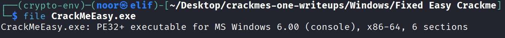
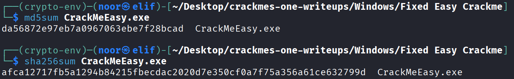
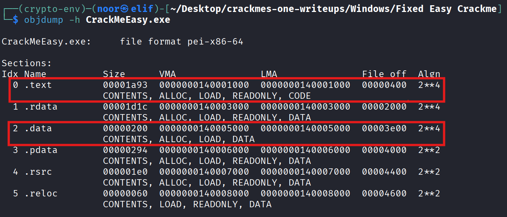
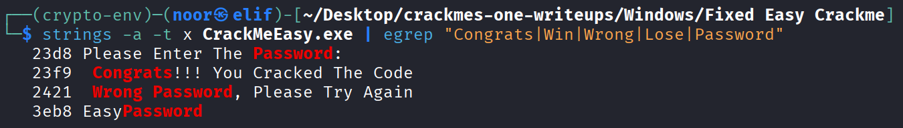
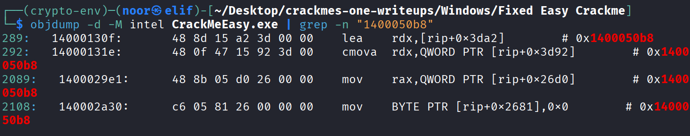
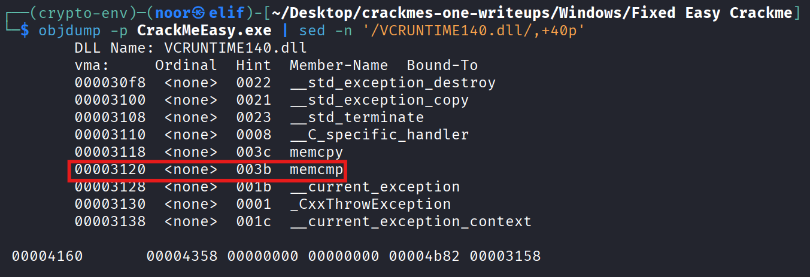
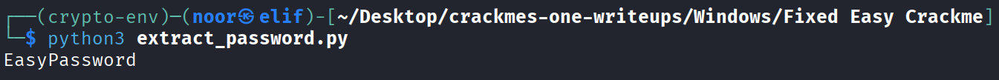
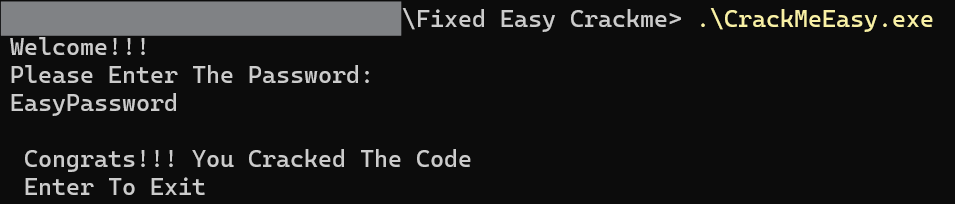

# Fixed Easy Crackme - Reverse Engineering Write-Up

**Category:** Reverse Engineering
**Difficulty:** Easy
**Challenge:** Fixed Easy Crackme
**Files:** `698d2206e2ba6023bfacaa4f.zip` (password: `crackmes.one`) → `CrackMeEasy.exe`

---

## TL;DR

Found the correct password as a plaintext string inside the binary’s `.data` section:

> **EasyPassword**

The program reads input into a `std::string`, checks the length, then compares it directly with `memcmp()`.

---

## Environment / Tools

Static analysis was enough (no Windows required):

* **Linux:** `file`, `strings`, `objdump`

---

## Artifact Fingerprint

### File identification

```bash
file CrackMeEasy.exe
# PE32+ executable (console) x86-64, for MS Windows, 6 sections
```


### Hashes (reproducibility)

```text
MD5:    da56872e97eb7a0967063ebe7f28bcad
SHA256: afca12717fb5a1294b84215fbecdac2020d7e350cf0a7f75a356a61ce632799d
```



### Sections

```bash
objdump -h CrackMeEasy.exe
```

Important parts:

* `.text` at **VMA `0x140001000`**
* `.data` at **VMA `0x140005000`**, **file offset `0x3e00`**



This mapping is needed to convert the password’s **file offset** into its **runtime address**.

---

## Solution Steps (single consolidated section)

### Step 1 — Quick win: hunt obvious strings

First thing I did was run `strings` and grep for anything related to success/failure messages or a possible embedded password:

```bash
strings -a -t x CrackMeEasy.exe | egrep "Congrats|Win|Wrong|Lose|Password"
```

Output:

```text
23f9  Congrats!!! You Cracked The Code
2421  Wrong Password, Please Try Again
3eb8  EasyPassword
```



Seeing `EasyPassword` inside the binary is already a huge hint, but I still wanted to confirm it’s actually used in the verification path.

---

### Step 2 — Map the string to a runtime address

From `objdump -h`, `.data` starts at:

* `.data` **VMA** = `0x140005000`
* `.data` **file offset** = `0x3e00`

`strings` showed the password at file offset `0x3eb8`, so the offset inside `.data` is:

```text
0x3eb8 - 0x3e00 = 0x0b8
```

Then the runtime address becomes:

```text
0x140005000 + 0x0b8 = 0x1400050b8
```

---

### Step 3 — Locate the check routine that references the password

Next I searched the disassembly for that computed address:

```bash
objdump -d -M intel CrackMeEasy.exe | grep -n "1400050b8"
```



That lands in the main verification block around `0x14000130f`.

#### Verification block (annotated)

```asm
14000130f: lea  rdx, [rip+0x3da2]      ; rdx = 0x1400050b8 ("EasyPassword")
...
140001326: mov  r8,  [rsp+0x30]        ; r8  = input_length
...
140001342: cmp  r8,  [rip+0x3d7f]      ; compare input_length with expected_length (0x1400050c8)
140001349: jne  wrong
14000134b: test r8, r8
14000134e: je   correct                ; empty special-case
140001350: call 0x140002843            ; thunk → memcmp(input, expected, len)
140001355: test eax, eax
140001357: jne  wrong
140001359: correct: load "Congrats!!!..."
140001362: wrong:   load "Wrong Password..."
```

So the logic is exactly what it looks like:

* Read input into a local `std::string`
* Check the length first (must be **12**)
* Call `memcmp()` to compare input bytes against the global string at `0x1400050b8`

No hashing, no encoding, no tricks.

---

### Step 4 — Explain the MSVC `std::string` SSO artifact

While looking at the code, there are a couple of instructions that look “weird” at first:

```asm
cmp   rdi, 0xf
cmova rcx, rbx
```

This is normal MSVC `std::string` **Small String Optimization (SSO)** behavior:

* For length **≤ 15**, the characters live inline inside the `std::string` object
* For longer strings, the object stores a heap pointer

The code is selecting the correct pointer to the character buffer depending on whether the string is in SSO mode.

---

### Step 5 — Confirm `memcmp` is imported (sanity check)

To double-check that the compare call really goes to `memcmp`, I inspected imports:

```bash
objdump -p CrackMeEasy.exe | sed -n '/VCRUNTIME140.dll/,+40p'
```



`memcmp` shows up under `VCRUNTIME140.dll`.

Also the thunk at `0x140002843` is a standard IAT jump:

```asm
140002843: jmp QWORD PTR [rip+0x8d7]   ; IAT entry → memcmp
```

This matches the verification block and confirms it’s a straight byte comparison.

---

### Step 6 — Extract the password reproducibly

Since the password is null-terminated ASCII at file offset `0x3eb8`, I wrote a tiny extractor to avoid manual copy/paste.

```python
# extract_password.py
OFF = 0x3EB8  # from: strings -a -t x

with open("CrackMeEasy.exe", "rb") as f:
    f.seek(OFF)
    out = bytearray()
    while True:
        b = f.read(1)
        if not b or b == b"�":
            break
        out += b

print(out.decode("ascii"))
```


Run:

```bash
python3 extract_password.py
# EasyPassword
```

---

### Step 7 — Dynamic validation (optional)

On Windows, running the program and entering the extracted password prints the success message:

```text
Congrats!!! You Cracked The Code
```


---

## Final Answer

**Password:**

> **EasyPassword**

---

## Notes / Takeaways

* `strings` is the fastest first move on easy crackmes.
* A clean write-up still proves it by:

  * mapping file offset → runtime address
  * finding the verification routine
  * confirming the compare is `memcmp`
* The `cmp 0xf / cmova` pattern is just MSVC `std::string` SSO, not obfuscation.
